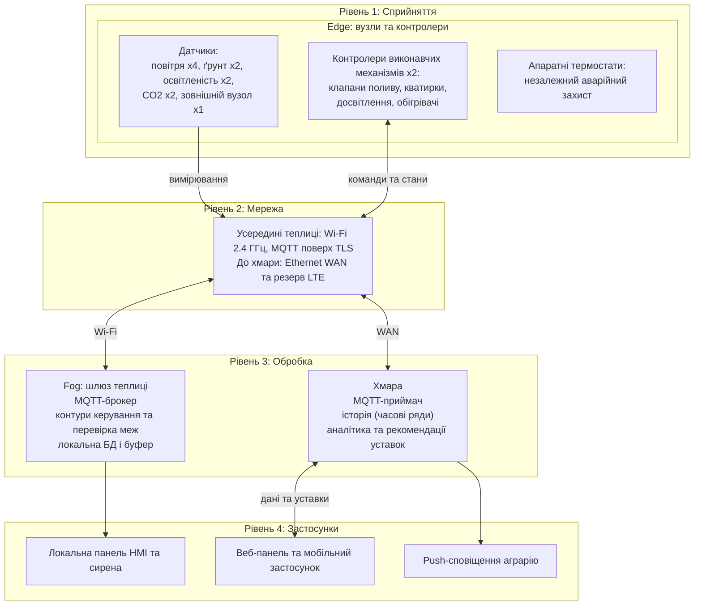
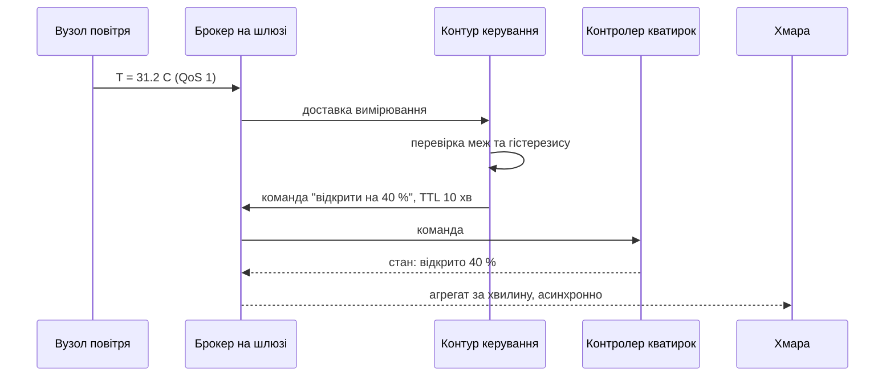
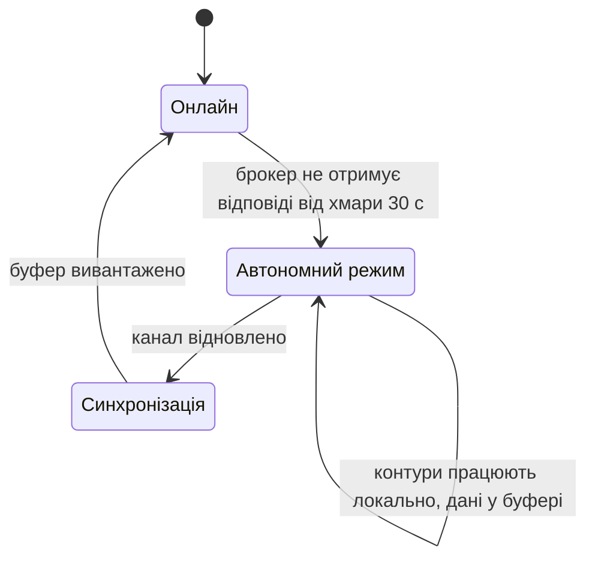

# Розумна теплиця 200 м²: проєкт IoT-системи автоматичного вирощування

**Дисципліна:** Технології IoT та SMART-технології
**Практична робота 1:** Вступ до IoT та SMART-технологій, варіант 1
**Тип роботи:** аналітично-проєктна, без програмування

## Зміст

1. [Мета та вихідні припущення](#1-мета-та-вихідні-припущення)
2. [Склад системи](#2-склад-системи)
3. [Архітектура](#3-архітектура)
4. [Керування: логіка та безпечні стани](#4-керування-логіка-та-безпечні-стани)
5. [Розміщення обробки: edge, fog, хмара](#5-розміщення-обробки-edge-fog-хмара)
6. [Сценарій втрати зв'язку з хмарою](#6-сценарій-втрати-звязку-з-хмарою)
7. [Оцінка добового обсягу телеметрії](#7-оцінка-добового-обсягу-телеметрії)
8. [Безпека](#8-безпека)
9. [Обмеження проєкту](#9-обмеження-проєкту)
10. [Джерела](#10-джерела)

---

## 1. Мета та вихідні припущення

**Мета.** Спроєктувати на рівні архітектури систему, яка автоматично підтримує мікроклімат і полив у теплиці площею 200 м², лишається працездатною без зв'язку з хмарою і має захист від типових загроз.

Згідно з ITU-T Y.2060 [1], IoT є глобальною інфраструктурою, що об'єднує фізичні та віртуальні «речі» на основі інтероперабельних ІКТ. У цьому проєкті «речами» є вузли датчиків, контролери виконавчих механізмів і шлюз.

**Вимоги із завдання.**

- Контроль: температура, вологість повітря, вологість ґрунту, освітленість, CO₂.
- Керування: полив, вентиляція, досвітлення, обігрів.
- Система працює без зв'язку з хмарою.
- Оцінка добового обсягу телеметрії.

**Припущення проєкту.** Це проєктні рішення, а не виміри на реальному об'єкті. Їх можна змінити, якщо зміняться умови.

| № | Припущення | Значення |
|---|-----------|----------|
| A1 | Геометрія | 8 × 25 м, дві незалежні зони по 100 м² |
| A2 | Живлення | Є мережа 230 В, тому вузли живляться від мережі й не працюють у режимі глибокого сну |
| A3 | Зв'язок з інтернетом | Ethernet як основний канал, LTE-роутер як резервний |
| A4 | Культура | Овочева культура закритого ґрунту. Уставки нижче наведено як приклад, реальні значення узгоджує агроном |
| A5 | Вимога до затримки контуру керування | Від надходження вимірювання до подачі команди не більше 5 с |
| A6 | Вимога до затримки захисних відключень | Не більше 1 с, без участі мережі |
| A7 | Вимога до автономності | Не менше 24 год повноцінної роботи без хмари, безпечна поведінка без обмеження в часі |

## 2. Склад системи

| Пристрій | Кількість | Що вимірює або робить | Де розміщено | Рівень |
|----------|-----------|----------------------|--------------|--------|
| Вузол повітря (мікроконтролер із Wi-Fi + датчик T/RH) | 4 (по 2 на зону) | Температура та відносна вологість повітря | На рівні крони, на висоті ≈1,5 м, у різних кінцях зони | Сприйняття |
| Вузол ґрунту (мікроконтролер + ємнісні зонди) | 2 (по 1 на зону), 8 зондів | Об'ємна вологість ґрунту (VWC) на глибині кореневої зони | У ґрунті, 4 зонди на зону, з рознесенням по рядах | Сприйняття |
| Вузол освітленості (мікроконтролер + люксметр) | 2 (по 1 на зону) | Освітленість над кроною | Над кроною, поза тінню конструкцій | Сприйняття |
| Вузол CO₂ (мікроконтролер + датчик CO₂, наприклад SCD41 [7]) | 2 (по 1 на зону) | Концентрація CO₂ у ppm | На висоті крони, далеко від кватирок і обігрівача | Сприйняття |
| Зовнішній вузол | 1 | Температура і вологість зовні | Північна стіна, під захисним екраном | Сприйняття |
| Контролер виконавчих механізмів (мікроконтролер + реле + власний датчик T) | 2 (по 1 на зону) | Виконує команди, вимикає навантаження за таймером і за власним датчиком | Розподільна шафа зони | Сприйняття |
| Електроклапан поливу (нормально закритий) | 2 | Подає воду в зону | Магістраль поливу | Сприйняття |
| Привід кватирок з кінцевими вимикачами | 2 | Відкриває й закриває кватирки | Верхні кватирки даху | Сприйняття |
| Фітосвітильники з контактором | 2 групи | Досвітлення | Над кроною | Сприйняття |
| Обігрівач із реле | 1 на зону | Обігрів повітря | Торець зони | Сприйняття |
| Апаратний термостат (незалежний від ПЗ) | 2 | Захист від замерзання і перегріву без участі мікроконтролера | Розподільна шафа зони, свій датчик | Сприйняття |
| Точка доступу Wi-Fi 2,4 ГГц | 1–2 | Зв'язок вузлів із шлюзом | Під стелею посередині теплиці | Мережа |
| Комутатор Ethernet | 1 | Локальна мережа шлюзу й точок доступу | Технічне приміщення | Мережа |
| LTE-роутер | 1 | Резервний вихід в інтернет | Технічне приміщення | Мережа |
| Шлюз теплиці (одноплатний комп'ютер або міні-ПК, MQTT-брокер, сервіс керування, локальна БД) | 1 | Fog-обробка: контури керування, буфер даних, локальний HMI | Технічне приміщення в корпусі IP54, підключений до ДБЖ | Обробка (fog) |
| Хмарна платформа | 1 | Довге зберігання, аналітика, панель, сповіщення, керування прошивками | Дата-центр провайдера | Обробка (хмара) |
| Веб-панель і мобільний застосунок | — | Перегляд, зміна уставок, сповіщення | Пристрої аграрія | Застосунки |

**Вибір технологій.**

- Вузли й шлюз обмінюються повідомленнями через **MQTT**. Це легкий протокол публікації та підписки, який працює поверх TCP/IP і має три рівні якості доставки [5].
- Для команд керування використовується QoS 1 («принаймні один раз»), тому кожна команда має бути ідемпотентною (див. розділ 4).
- **Wi-Fi 2,4 ГГц** обрано тому, що вузли мають мережеве живлення (A2), а відстані невеликі. Через це LoRaWAN і Zigbee тут не дають переваг. Ця відповідь є проєктним рішенням, а не результатом вимірювань на об'єкті.
- Специфікація датчика SCD41 обмежує діапазон вимірювання CO₂ значеннями 400–5000 ppm [7]. Для теплиці цього достатньо, але значення нижче 400 ppm слід сприймати як орієнтовні.
- Для освітленості використано люксметр як наближення. Рослинам потрібне фотосинтетично активне випромінювання (PAR), тому для точного керування бажано замінити люксметр на PAR-датчик або калібрувати перерахунок люкс → PAR для конкретних ламп.

## 3. Архітектура

Чотирирівнева модель: сприйняття, мережа, обробка, застосунки.

**Пояснення до діаграми.**

- Усі вузли спілкуються тільки зі шлюзом. Хмара не входить у контур керування, вона лише бачить дані й надсилає рекомендовані уставки.
- Мережевий рівень показано одним вузлом: усередині теплиці вузли працюють через Wi-Fi, а шлюз виходить до хмари через WAN. Склад пристроїв мережі наведено в таблиці розділу 2.
- Апаратні термостати не мають зв'язку з мережею: вони окремо захищають обігрівачі й кватирки від перегріву та замерзання.
- Пунктирні лінії показують незалежний апаратний захист. Він працює навіть тоді, коли зависла програмна частина.

**Один цикл керування (приклад: перегрів).**

Орієнтовний бюджет затримки цього ланцюга (інженерна оцінка, не вимір): два Wi-Fi-переходи по 10–50 мс, обробка на шлюзі до 100 мс, тобто типово менше 0,5 с. Це вкладається у вимогу A5 (5 с) із запасом.

## 4. Керування: логіка та безпечні стани

Значення уставок наведено як приклад (A4), їх налаштовує агроном.

| Підсистема | Вхідні дані | Логіка (на шлюзі) | Безпечний стан при втраті команд |
|-----------|-------------|-------------------|--------------------------------|
| Полив | Середня VWC зони, вікно часу | Відкрити клапан, якщо VWC нижче нижньої межі. Закрити при верхній межі або через 15 хв. Пауза між циклами не менше 30 хв | Клапан нормально закритий, а кожна команда містить TTL (макс. час). Без нової команди клапан закривається сам |
| Вентиляція | T і RH повітря, зовнішня T | Пропорційне відкриття, якщо T вище верхньої уставки. Додаткове відкриття при RH > 85 %. Обмеження, якщо зовні T < 5 °C. Гістерезис 1–2 °C | Контролер працює за власним датчиком T: відкрити при T > 30 °C, закрити при T < 10 °C. Апаратний термостат дублює це |
| Досвітлення | Освітленість, розклад фотоперіоду | Увімкнути в межах фотоперіоду, якщо освітленість нижче цілі. Мінімальний час ввімкнення/вимкнення 10 хв | Вимкнено (не завдає шкоди рослинам за короткий час) |
| Обігрів | T повітря, стан кватирок | Увімкнути, якщо T нижче нижньої уставки. Блокування: не гріти, коли кватирки відкриті більше ніж на 20 % | Апаратний термостат утримує мінімум +8…+10 °C та вимикає нагрів при перегріві |
| CO₂ | Концентрація CO₂ | Тільки контроль. Падіння значення до атмосферного вдень підказує, що потрібне провітрювання. Значення понад 1500 ppm породжує сповіщення | Не керує виконавчими механізмами |

**Загальні принципи.**

- Кожна команда має TTL і є ідемпотентною, тому повторна доставка при QoS 1 не шкодить.
- Шлюз перевіряє, що уставка або команда лежить у допустимих межах, незалежно від джерела (панель, хмара, локальний HMI).
- Показання перед використанням перевіряються на правдоподібність: діапазон і швидкість зміни. Некоректне показання виключається з усереднення й породжує сповіщення.

## 5. Розміщення обробки: edge, fog, хмара

Розрізнення рівнів подано за моделлю NIST SP 500-325 [2], яка розглядає fog як проміжний рівень між пристроями та хмарою. У документі також зазначено, що єдиного консенсусу щодо меж між edge, fog і mist немає, тому в цій роботі використано робоче розмежування, наведене нижче.

| Функція | Вимога до затримки або доступності | Де виконується | Обґрунтування |
|---------|-----------------------------------|----------------|---------------|
| Опитування датчика, медіанний фільтр (6 вимірів по 10 с), формування повідомлення | Не критично, локально на вузлі | **Edge** (вузол) | Зменшує шум і трафік: замість 6 повідомлень за хвилину йде одне |
| Аварійне відключення обігріву, аварійне відкриття кватирок, автозакриття клапана за TTL | ≤ 1 с (A6), без мережі | **Edge** (контролер і апаратний термостат) | Має працювати навіть тоді, коли зникли Wi-Fi і шлюз |
| Контури керування поливом, вентиляцією, обігрівом, досвітленням | ≤ 5 с (A5) і працездатність без WAN | **Fog** (шлюз) | Внутрішня мережа дає малу й передбачувану затримку. Хмара не може гарантувати ні затримку, ні наявність каналу |
| Локальне зберігання й буфер | Автономність ≥ 24 год (A7) | **Fog** | Дані не втрачаються при обриві WAN |
| Історія за місяці й роки, порівняння сезонів, аналітика, рекомендації уставок | Хвилини та години | **Хмара** | Потрібні великі обчислення й довге зберігання, затримка не важлива |
| Сповіщення аграрію на телефон | ≈ десятки секунд | **Хмара** (з локальною сиреною як запасом) | Потрібен канал до користувача, який є лише через інтернет |

**Головний висновок.** Процеси в теплиці повільні (температура повітря змінюється за хвилини), тому саме по собі число «мілісекунд» тут не вирішальне. Місце для контурів керування визначає **вимога доступності**: цикл керування не повинен залежати від зовнішнього каналу. Через це контури живуть на fog-рівні, а хмара лишається «радником», а не «пілотом».

## 6. Сценарій втрати зв'язку з хмарою

**Що відбувається.**

1. Шлюз фіксує обрив (пропущені keep-alive MQTT [5], немає відповіді 30 с) і переходить в автономний режим. Керування поливом, вентиляцією, обігрівом і досвітленням не змінюється, бо воно й так виконується на шлюзі.
2. Усі вимірювання пишуться в локальну БД. Повідомлення для хмари не губляться, а накопичуються в черзі на диску шлюзу. У брокері Mosquitto для цього використовують міст до хмарного брокера та налаштування збереження стану на диск [6]. Точні параметри слід звірити з документацією під час реалізації.
3. Шлюз вмикає локальну індикацію «немає зв'язку з хмарою» на HMI. Якщо LTE-резерв також недоступний, лунає сигнал про потребу перевірити канал.
4. Уставки, отримані з хмари раніше, лишаються діючими. Нові уставки з хмари не приходять, тому працюють останні відомі.
5. Після відновлення каналу шлюз вивантажує буфер пакетом, далі відновлює потоковий режим. Хмара розкладає дані за часом вимірювання, а не за часом отримання.

**Оцінка буфера.** Локально зберігаються 22 значення на хвилину. Приймемо 12 Б на значення (мітка часу + значення): 22 × 12 Б × 1440 хв ≈ 0,38 МБ на добу, ≈139 МБ на рік без індексів. Навіть із 5-кратним запасом на індекси й службові дані це менше 1 ГБ на рік, тобто картки пам'яті на десятки гігабайт вистачає на роки. Вивантаження добового бекслогу з хмарним потоком ≈0,65 МБ займе орієнтовно 5–10 с при каналі 1 Мбіт/с (0,65 МБ ≈ 5,2 Мбіт).

**Розширення сценарію: втрата шлюзу.** Якщо відмовляє сам шлюз, контролери виконавчих механізмів переходять у безпечний режим за власним датчиком і таймерами (колонка «Безпечний стан» у розділі 4). Полив припиняється, досвітлення вимкнене, температура утримується апаратними термостатами.

**Розширення сценарію: зникнення живлення.** Клапани нормально закриті, тому вода перекривається. Досвітлення й обігрів вимикаються. Шлюз і роутери працюють від ДБЖ і коректно завершують запис на диск. Кватирки зупиняються в поточному положенні, а після повернення живлення контролер перевіряє показання й виставляє безпечне положення.

## 7. Оцінка добового обсягу телеметрії

**Вихідні дані.**

- 11 вузлів вимірювання: 4 (повітря) + 2 (ґрунт) + 2 (освітленість) + 2 (CO₂) + 1 (зовнішній).
- Значень за цикл: повітря 4 × 2 = 8, ґрунт 8, освітленість 2, CO₂ 2, зовнішній 2, разом **22 значення**.
- Період передачі: **60 с**. Обґрунтування: повітря в теплиці змінює температуру за хвилини, ґрунт ще повільніше. Час відгуку датчика CO₂ SCD41 (τ63 %) за даними виробника становить 60 с [7], тому частіше передавати немає сенсу.
- Вузол вимірює кожні 10 с, фільтрує (медіана з 6 вимірів) і надсилає одне повідомлення на хвилину. Виняток: якщо межа перевищена, вузол передає повідомлення негайно (звітування за винятком, воно рідкісне й у розрахунок не входить).

**Розмір повідомлення (оцінка).**

| Складова | Байт |
|----------|------|
| Фіксований заголовок MQTT PUBLISH | 2 |
| Довжина топіка + сам топік (наприклад, `gh1/zone1/air/n01/telemetry`) | ≈ 32 |
| Ідентифікатор пакета (QoS 1) | 2 |
| Корисне навантаження JSON (мітка часу, два значення, служебні поля) | ≈ 100 |
| **Разом на рівні застосунку** | **≈ 140** |
| Оцінка накладних витрат TCP/IP + TLS + підтвердження на повідомлення | ≈ 110 |
| **Разом із мережевими накладними витратами** | **≈ 250** |

**Розрахунок для періоду 60 с.**

| Ділянка | Повідомлень на добу | Обсяг на добу |
|---------|--------------------|---------------|
| Вузли → шлюз (рівень застосунку) | 11 × 1440 = 15 840 | 15 840 × 140 Б ≈ **2,2 МБ** |
| Вузли → шлюз (з накладними витратами) | 15 840 | 15 840 × 250 Б ≈ **4,0 МБ** (≈ 119 МБ на місяць) |
| Шлюз → хмара (агрегат раз на хвилину, ≈450 Б, з накладними ≈560 Б) | 1440 | ≈ 0,65 МБ (≈ **0,8 МБ** з накладними, ≈ 24 МБ на місяць) |

Висновок: fog-агрегація зменшує WAN-трафік приблизно в 5 разів порівняно з пересиланням «сирих» повідомлень у хмару (0,8 МБ проти 4,0 МБ). Це робить прийнятним і резервний LTE-канал.

**Чутливість до періоду опитування (рівень застосунку, 140 Б/повідомлення).**

| Період | Повідомлень на добу | Обсяг на добу |
|--------|--------------------|---------------|
| 10 с | 11 × 8640 = 95 040 | ≈ 13,3 МБ |
| 60 с (обрано) | 15 840 | ≈ 2,2 МБ |
| 5 хв | 11 × 288 = 3 168 | ≈ 0,44 МБ |

Додатково: події керування (команди й стани) і службові повідомлення шлюзу дають порядку 0,2 МБ на добу, тобто менше 10 % від основного потоку. Вузли мають мережеве живлення (A2) і тримають постійне з'єднання. Якби вони перепідключалися до брокера при кожній передачі (наприклад, у режимі глибокого сну), повторні TLS-рукостискання збільшили б обсяг на порядок.

## 8. Безпека

Загрози подано з урахуванням рекомендацій ENISA [4] і NIST IR 8259 [3]. Ключовий принцип: у теплиці наслідки атаки фізичні (перегрів, замерзання, затоплення, знищення врожаю), тому захист має обмежувати саме вплив на виконавчі механізми.

| № | Загроза | Що постраждає | Захід протидії |
|---|---------|---------------|----------------|
| T1 | **Підміна або ін'єкція MQTT-команд:** зловмисник публікує повідомлення в топіки керування | Полив, вентиляція, обігрів. Можливе знищення врожаю | Взаємна автентифікація TLS із власним сертифікатом для кожного пристрою. Заборона анонімних підключень. ACL за топіками: вузол може публікувати тільки у свої топіки, команди може публікувати тільки сервіс керування. Перевірка меж і TTL команд на шлюзі |
| T2 | **Стандартні або слабкі облікові дані, відкриті сервіси** на вузлах і шлюзі | Повний контроль над пристроєм | Унікальні облікові дані на кожен пристрій, відсутність паролів за замовчуванням. Вимкнені всі непотрібні сервіси. Вхідні з'єднання з WAN заборонені, шлюз сам ініціює вихідне з'єднання до хмари. Віддалений доступ тільки через VPN |
| T3 | **Підміна прошивки:** шкідливе або пошкоджене оновлення | Постійна компрометація вузла | Підписані оновлення прошивки, перевірка підпису при завантаженні (secure boot), шифрування флеш-пам'яті, можливість відкату. Передача оновлень тільки каналом із TLS |
| T4 | **Глушіння Wi-Fi, DoS або обрив WAN** | Втрата керування й моніторингу | Автономний режим шлюзу, безпечні стани контролерів, апаратні термостати. Резервний канал LTE. Сповіщення, якщо вузол мовчить понад три періоди |
| T5 | **Фізичний доступ:** підміна датчика, вилучення картки пам'яті, вимкнення живлення | Спотворені дані, викрадення ключів | Пломбування корпусів шлюзу й шаф. Секрети у захищеному сховищі, а не у відкритих файлах. Відкликання сертифіката викраденого пристрою. Перевірка правдоподібності показань виявляє несправні або підмінені датчики |
| T6 | **Компрометація хмарного облікового запису** | Зміна уставок, доступ до історії | Багатофакторна автентифікація, розмежування ролей (лише перегляд / оператор / адміністратор), журнал аудиту. **Межі допустимих уставок перевіряє шлюз, тому навіть зламана хмара не може дати команду вийти за безпечні межі** |

**Залишковий ризик.** Апаратні термостати й нормально закриті клапани обмежують збитки навіть при повній програмній компрометації, але не замінюють захисту мережі. Тому заходи T1–T6 застосовуються разом.

## 9. Обмеження проєкту

- Розрахунки обсягів ґрунтуються на оціночних розмірах повідомлень (розділ 7). Реальний обсяг залежить від формату корисного навантаження, бібліотеки MQTT і версії TLS, тому його слід перевірити вимірюванням на прототипі.
- Уставки керування ілюстративні (A4) і не є агрономічною рекомендацією.
- Вартість, точний вибір моделей мікроконтролерів, датчиків і приводів не входять у завдання, тому не оцінювалися.
- Кількість і розміщення вузлів залежать від фактичної планувальної схеми теплиці, тому наведені значення є початковою пропозицією.

## 10. Джерела

Дата звернення до всіх джерел: **30.09.2026**.

1. ITU-T Recommendation Y.2060 (06/2012, перенумеровано Y.4000/Y.2060), *Overview of the Internet of things*. https://www.itu.int/rec/T-REC-Y.2060/en
2. Iorga M. та ін. *Fog Computing Conceptual Model*, NIST Special Publication 500-325, 2018. https://doi.org/10.6028/NIST.SP.500-325
3. Fagan M. та ін. *Foundational Cybersecurity Activities for IoT Device Manufacturers*, NIST IR 8259, 2020. https://csrc.nist.gov/pubs/ir/8259/final (NIST також опублікував оновлену редакцію NIST IR 8259r1 для виробників IoT-продуктів).
4. ENISA. *Baseline Security Recommendations for IoT in the context of Critical Information Infrastructures*, листопад 2017. https://www.enisa.europa.eu/publications/baseline-security-recommendations-for-iot
5. OASIS. *MQTT Version 5.0*, OASIS Standard, 07.03.2019. https://docs.oasis-open.org/mqtt/mqtt/v5.0/os/mqtt-v5.0-os.html
6. Eclipse Mosquitto. *mosquitto.conf(5)* (налаштування слухачів, автентифікації, мостів). https://mosquitto.org/man/mosquitto-conf-5.html
7. Sensirion. *SCD41: CO₂ sensor*, сторінка продукту й даташит серії SCD4x. https://sensirion.com/products/catalog/SCD41
8. Mermaid. *Flowcharts: basic syntax*. https://mermaid.js.org/syntax/flowchart.html
